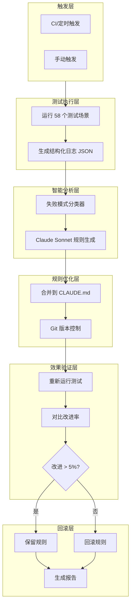

# Document Skill 自动校准系统

## 系统目标

通过全自动化流程持续优化 cowork 后端（MiniMax 2.1）的 CLAUDE.md，提升文档处理能力的准确率和稳定性。

## 架构概览



## 模块一：Document Skill 验证器

### 目录结构

```
tests/skills/document/
├── vitest.doc.config.js          # Vitest 配置
├── setup.js                      # 全局设置
├── helpers/
│   ├── skillTestClient.js        # Chat API 封装
│   ├── skillChecker.js           # Skill 安装检查
│   └── assertions.js             # 自定义断言
├── excel.skill.test.js           # Excel 12 场景
├── word.skill.test.js            # Word 10 场景
├── ppt.skill.test.js             # PPT 10 场景
├── pdf.skill.test.js             # PDF 12 场景
├── workflow.skill.test.js        # 端到端 6 场景
├── error.skill.test.js           # 错误处理 8 场景
└── fixtures/                     # 测试样本文件
    ├── sample-data.xlsx          # Excel 样本（含数据和公式）
    ├── sample-report.docx        # Word 样本（标题+段落+表格）
    ├── sample-slides.pptx        # PPT 样本（3页幻灯片）
    ├── sample-document.pdf       # PDF 样本（文本+表格）
    ├── sample-form.pdf           # PDF 表单（可填写字段）
    ├── empty.xlsx                # 空工作簿（错误处理测试）
    ├── broken.xlsx               # 含 #REF! 公式（公式错误测试）
    ├── encrypted.pdf             # 加密 PDF（密码测试）
    └── expected/                 # Golden Files
        ├── excel-a1-value.txt
        ├── word-full-text.txt
        └── pdf-table-data.json
```

### 样本文件生成策略

使用 Python 脚本自动生成样本文件，保证可重复、可版本控制：

```python
# scripts/generate-fixtures.py
from openpyxl import Workbook
from docx import Document
from pptx import Presentation
from reportlab.pdfgen import canvas
from pypdf import PdfWriter

# Excel 样本
wb = Workbook()
ws = wb.active
ws['A1'] = 'Hello'           # DOC-X01 验证点
ws['A2'], ws['A3'] = 100, 200
ws['B1'] = '=SUM(A2:A10)'    # 公式测试
wb.save('fixtures/sample-data.xlsx')

# Word 样本 - 用 python-docx
# PDF 样本 - 用 reportlab
# PPT 样本 - 用 python-pptx
```

样本文件清单：

| 文件                | 生成方式 | 用途                |
| ------------------- | -------- | ------------------- |
| sample-data.xlsx    | 脚本生成 | Excel 读取/编辑测试 |
| sample-report.docx  | 脚本生成 | Word 读取/提取测试  |
| sample-slides.pptx  | 脚本生成 | PPT 读取/编辑测试   |
| sample-document.pdf | 脚本生成 | PDF 读取/表格测试   |
| sample-form.pdf     | 手动创建 | PDF 表单填写测试    |
| empty.xlsx          | 脚本生成 | 空文件错误处理      |
| broken.xlsx         | 脚本生成 | 公式错误检测        |
| encrypted.pdf       | 脚本生成 | 加密文件处理        |

### 测试场景矩阵 (58 场景)

- **Excel (12)**: 读取/创建/公式/格式/分析
- **Word (10)**: 读取/创建/红线批注/评论/合并
- **PPT (10)**: 读取/创建/模板/编辑/缩略图
- **PDF (12)**: 读取/表格/合并/拆分/表单/水印
- **端到端 (6)**: 跨格式转换工作流
- **错误处理 (8)**: 边界情况验证

### 核心文件

- `helpers/skillTestClient.js` - 封装 Chat API 调用，收集工具调用链
- `helpers/assertions.js` - 文件存在性、内容匹配、Golden File 对比

## 模块二：失败分析器

### 结构化日志格式

```javascript
// test-result.json
{
  "runId": "run-xxx",
  "claudeMdVersion": "git-commit-hash",
  "summary": { "total": 58, "passed": 42, "failed": 16 },
  "failures": [{
    "testId": "DOC-X01",
    "prompt": "读取 sample.xlsx 的 A1 单元格",
    "toolCalls": [{ "tool": "bash", "args": {...}, "error": "..." }],
    "errorPattern": "PATH_NOT_VERIFIED"
  }]
}
```

### 失败模式分类器

预定义模式 + 关键词匹配：

- `PATH_NOT_VERIFIED` - 未验证文件存在
- `PATH_RELATIVE` - 相对路径问题
- `FILE_NOT_READ_FIRST` - 编辑前未读取
- `TOOL_WRONG_PARAMS` - 工具参数错误
- `FORMULA_ERROR` - Excel 公式错误

核心文件：`scripts/classifier.js`

## 模块三：LLM 规则生成器

### 工作流程

1. 聚合同类失败模式
2. 构造分析 prompt（含当前 CLAUDE.md + 失败详情）
3. 调用 Claude Sonnet 生成规则建议
4. 解析 JSON 格式的规则输出

### 规则输出格式

```javascript
{
  "newRules": [{
    "id": "RULE-001",
    "category": "文件操作",
    "content": "执行文件操作前，必须先用 ls 验证目标存在",
    "targetTests": ["DOC-X01", "DOC-W01"],
    "priority": "high"
  }],
  "confidence": 0.85
}
```

核心文件：`scripts/rule-generator.js`

## 模块四：CLAUDE.md 自动更新

### 功能

1. 解析规则 JSON，格式化为 Markdown
2. 插入到 CLAUDE.md 指定位置
3. Git 自动提交，记录规则来源和目标测试

### 版本控制策略

- 每次优化创建独立 commit
- commit message 包含规则 ID 和置信度
- 支持按 commit hash 回滚

核心文件：`scripts/claude-md-updater.js`

## 模块五：效果验证器

### 验证逻辑

1. 对比优化前后通过率
2. 检测回归（之前通过现在失败）
3. 阈值判断：改进 > 5% 且无回归 → 保留

### 决策矩阵

| 改进率 | 有回归 | 决策        |
| ------ | ------ | ----------- |
| > 5%   | 否     | 保留规则    |
| > 5%   | 是     | 回滚 + 告警 |
| <= 5%  | -      | 回滚        |

核心文件：`scripts/effect-validator.js`

## 模块六：主调度器

### 单次优化周期

```
1. 运行基准测试 → 收集日志
2. 分类失败模式
3. LLM 生成规则（置信度 < 0.5 则跳过）
4. 应用规则 + Git 提交
5. 重新测试
6. 验证效果 → 保留或回滚
7. 生成报告
```

核心文件：`scripts/auto-optimizer.js`

## NPM Scripts

```json
{
  "fixtures:generate": "python scripts/generate-fixtures.py",
  "test:skills:doc": "vitest run --config tests/skills/document/vitest.doc.config.js",
  "optimize:run": "node scripts/auto-optimizer.js",
  "optimize:dry-run": "node scripts/auto-optimizer.js --dry-run",
  "optimize:rollback": "node scripts/rollback.js"
}
```

## 关键文件清单

| 文件                                               | 用途             |
| -------------------------------------------------- | ---------------- |
| `scripts/generate-fixtures.py`                     | 样本文件生成脚本 |
| `tests/skills/document/vitest.doc.config.js`       | 测试配置         |
| `tests/skills/document/helpers/skillTestClient.js` | Chat API 封装    |
| `tests/skills/document/*.skill.test.js`            | 58 个测试场景    |
| `tests/skills/document/fixtures/`                  | 测试样本文件     |
| `scripts/classifier.js`                            | 失败模式分类器   |
| `scripts/rule-generator.js`                        | LLM 规则生成     |
| `scripts/claude-md-updater.js`                     | CLAUDE.md 更新   |
| `scripts/effect-validator.js`                      | 效果验证         |
| `scripts/auto-optimizer.js`                        | 主调度器         |
| `reports/`                                         | 优化报告存储     |

## 自动化程度

| 环节     | 自动化 | 方式          |
| -------- | ------ | ------------- |
| 测试执行 | 100%   | Vitest + CI   |
| 日志收集 | 100%   | JSON 结构化   |
| 失败分类 | 95%    | 规则 + 关键词 |
| 规则生成 | 90%    | Claude Sonnet |
| 规则应用 | 100%   | 脚本更新      |
| 效果验证 | 100%   | 对比测试      |
| 回滚决策 | 100%   | 阈值判断      |
