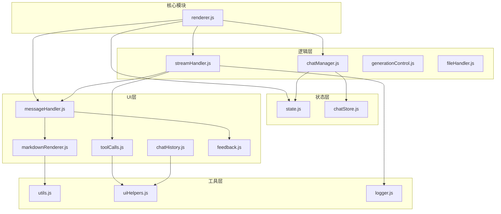

# renderer.js 深度解耦计划

## 当前状态分析

### 已完成的模块化（8个模块）

- `modules/state.js` - 集中状态管理（已创建但未完全使用）
- `modules/toolCalls.js` - 工具调用管理
- `modules/chatHistory.js` - 聊天历史渲染
- `modules/feedback.js` - Toast/错误重试
- `modules/logger.js` - 日志功能
- `modules/settings.js` - 设置管理
- `modules/skillsManager.js` - 技能管理
- `modules/theme.js` - 主题切换

### 辅助模块

- `utils.js` - 通用工具函数
- `chatStore.js` - 聊天数据存储
- `uiHelpers.js` - UI辅助函数
- `sessionManager.js` - 工具调用操作（与 toolCalls.js 有重叠）

### renderer.js 待拆分功能（约 1200 行）

| 功能区域 | 行数 | 复杂度 | 优先级 |

|---------|-----|-------|-------|

| SSE 流式处理 | ~300 | 高 | P0 |

| 消息处理 | ~200 | 中 | P0 |

| Markdown 渲染 | ~100 | 中 | P1 |

| 事件监听设置 | ~100 | 低 | P2 |

| 文件处理 | ~100 | 低 | P2 |

| 聊天管理 | ~150 | 中 | P1 |

| 搜索功能 | ~70 | 低 | P3 |

| DOM 元素管理 | ~35 | 低 | P3 |

| 生成状态控制 | ~50 | 低 | P2 |

| 模板功能 | ~30 | 低 | P3 |

| Resizer 设置 | ~70 | 低 | P3 |

## 拆分方案

### Phase 1: 高优先级模块（P0-P1）

#### 1.1 创建 `modules/streamHandler.js`

从 `handleSendMessage()` 提取 SSE 流式处理逻辑：

```javascript
// 主要导出
export async function processSSEStream(reader, callbacks)
export function parseSSEEvent(data)
export function handleTextEvent(data, contentDiv)
export function handleToolUseEvent(data, contentDiv, pendingToolCalls)
export function handleToolResultEvent(data, pendingToolCalls)
export function handleAssistantEvent(data, contentDiv, pendingToolCalls)
```

关键依赖：

- `modules/toolCalls.js` - 工具调用创建和更新
- `modules/logger.js` - 日志记录
- 回调函数注入处理 UI 更新

#### 1.2 创建 `modules/messageHandler.js`

提取消息创建和更新逻辑：

```javascript
// 主要导出
export function addUserMessage(container, text)
export function createAssistantMessage(container)
export function appendToContent(contentDiv, content)
export function updateGenerationStatus(messageDiv, text)
export function removeGenerationStatus(messageDiv)
export function scrollToBottom(container)
```

#### 1.3 创建 `modules/markdownRenderer.js`

提取 Markdown 渲染逻辑：

```javascript
// 主要导出
export function getCurrentMarkdownContainer(contentDiv)
export function renderMarkdownContainer(container)
export function renderMarkdown(contentDiv)
export function enhanceCodeBlocks(container)
```

依赖：marked 库、`modules/feedback.js`

#### 1.4 创建 `modules/chatManager.js`

提取聊天管理逻辑：

```javascript
// 主要导出
export function loadChat(chat, callbacks)
export function saveCurrentChat(state, container, callbacks)
export function switchToChat(chatId, state, callbacks)
export function startNewChat(state, callbacks)
export function deleteChat(chatId, state, callbacks)
```

依赖：`chatStore.js`

### Phase 2: 中优先级模块（P2）

#### 2.1 创建 `modules/generationControl.js`

提取生成状态控制：

```javascript
export function setGeneratingState(generating, elements)
export function handleStopGeneration(requestId)
```

#### 2.2 创建 `modules/fileHandler.js`

提取文件处理逻辑：

```javascript
export function handleFileSelect(event, context, attachedFiles)
export function renderAttachedFiles(container, files, context)
export function removeAttachedFile(files, index, context, callback)
export function addFileChange(name, path, type, stats)
export function renderFileChanges(container, changes)
```

#### 2.3 创建 `modules/eventSetup.js`

提取事件监听器设置：

```javascript
export function setupFormListeners(forms, handlers)
export function setupDropdowns(elements, state)
export function setupResizers(elements, storage)
export function setupTemplateListeners(cards, handler)
```

### Phase 3: 低优先级模块（P3）

#### 3.1 创建 `modules/domElements.js`

集中管理 DOM 元素引用：

```javascript
// 使用 getter 函数延迟初始化
export function getElement(id)
export function getElements() // 返回所有常用元素

// 分组元素
export const views = { home, chat }
export const forms = { homeForm, chatForm }
export const inputs = { homeInput, messageInput }
export const buttons = { homeSendBtn, chatSendBtn, ... }
export const sidebars = { left, right }
```

#### 3.2 创建 `modules/searchHandler.js`

提取搜索功能：

```javascript
export function searchChats(query, container)
export function initializeSearch(container, callback)
```

#### 3.3 创建 `modules/templateManager.js`

提取模板功能：

```javascript
export function loadTemplate(templateType, input)
export function hideTemplates()
export function showTemplates()
```

### Phase 4: 整合与清理

#### 4.1 整合状态管理

当前 renderer.js 中的局部状态变量未使用 `modules/state.js`：

```javascript
// renderer.js 中的局部变量
let isFirstMessage = true;
let todos = [];
let toolCalls = [];
// ...

// 应迁移到使用 appState
import { appState } from './modules/state.js';
```

#### 4.2 清理重复代码

- `sessionManager.js` 与 `modules/toolCalls.js` 功能重叠，建议整合
- 移除未使用的函数

#### 4.3 重构后的 renderer.js 结构

```javascript
// renderer.js（目标 ~400-500 行）
import { appState } from './modules/state.js';
import { getElements } from './modules/domElements.js';
import { processSSEStream } from './modules/streamHandler.js';
import { addUserMessage, createAssistantMessage } from './modules/messageHandler.js';
import { loadChat, saveCurrentChat, startNewChat } from './modules/chatManager.js';
// ... 其他导入

// 核心初始化
function init() {
  /* 协调各模块初始化 */
}

// 核心消息发送（使用 streamHandler）
async function handleSendMessage(e) {
  /* 简化后的协调逻辑 */
}

// 视图切换
function switchToChatView() {
  /* ... */
}
function switchToHomeView() {
  /* ... */
}

// 全局函数挂载（向后兼容）
window.startNewChat = startNewChat;
window.deleteChat = deleteChat;
// ...

// 初始化
window.addEventListener('load', init);
```

## 模块依赖关系图



## 实施步骤

1. **Step 1**: 创建 `messageHandler.js`（风险低，依赖少）
2. **Step 2**: 创建 `markdownRenderer.js`（风险低）
3. **Step 3**: 创建 `chatManager.js`（中等风险）
4. **Step 4**: 创建 `streamHandler.js`（高风险，核心逻辑）
5. **Step 5**: 创建剩余模块（fileHandler, generationControl 等）
6. **Step 6**: 迁移 renderer.js 使用 appState
7. **Step 7**: 清理 sessionManager.js 重复代码
8. **Step 8**: 运行完整测试套件验证

## 预期成果

- renderer.js 从 1699 行减少到 400-500 行
- 新增 6-8 个功能模块，每个 100-200 行
- 提升代码可测试性（模块间依赖明确）
- 降低修改风险（修改范围更可控）

## 风险控制

- 每个模块拆分后立即运行 `npm test`
- 保持全局函数（`window.xxx`）向后兼容
- 使用回调函数注入避免循环依赖
- 高风险模块（streamHandler）最后拆分
