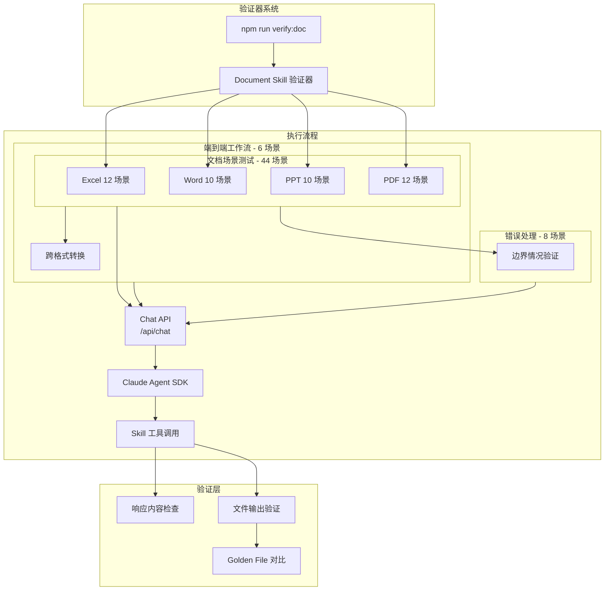

# Document Skill 功能验证器

## 设计目标

通过真实 AI 对话验证 Document Skill 安装后的文档处理功能是否正常工作。测试通过 = 功能可信 = 可安全合并代码。

## 架构概览



## 测试场景总览

| 类别              | P0 (必须通过) | P1 (应该通过) | P2 (最好通过) | 合计   |
| ----------------- | ------------- | ------------- | ------------- | ------ |
| Excel (xlsx)      | 6             | 4             | 2             | 12     |
| Word (docx)       | 4             | 5             | 1             | 10     |
| PowerPoint (pptx) | 3             | 5             | 2             | 10     |
| PDF               | 5             | 4             | 3             | 12     |
| 端到端工作流      | 2             | 3             | 1             | 6      |
| 错误处理          | 3             | 3             | 2             | 8      |
| **合计**          | **23**        | **24**        | **11**        | **58** |

## 目录结构

```
tests/
├── skills/
│   └── document/                        # Document Skill 功能测试
│       ├── vitest.doc.config.js         # 文档测试专用配置
│       ├── setup.js                     # 全局设置
│       ├── helpers/
│       │   ├── skillTestClient.js       # Chat API 调用封装
│       │   ├── skillChecker.js          # Skill 安装状态检查
│       │   └── assertions.js            # 自定义断言
│       ├── excel.skill.test.js          # Excel 12 个场景
│       ├── word.skill.test.js           # Word 10 个场景
│       ├── ppt.skill.test.js            # PPT 10 个场景
│       ├── pdf.skill.test.js            # PDF 12 个场景
│       ├── workflow.skill.test.js       # 端到端工作流 6 个场景
│       ├── error.skill.test.js          # 错误处理 8 个场景
│       └── fixtures/
│           ├── sample-data.xlsx
│           ├── sample-report.docx
│           ├── sample-slides.pptx
│           ├── sample-document.pdf
│           ├── sample-form.pdf
│           ├── empty.xlsx
│           ├── encrypted.pdf
│           └── expected/                # Golden Files
│               ├── excel-a1-value.txt
│               ├── word-full-text.txt
│               └── pdf-table-data.json
```

## 核心组件

### 1. Skill 测试客户端 - `skillTestClient.js`

封装与 Chat API 的交互，发送自然语言指令并收集响应：

```javascript
// tests/skills/document/helpers/skillTestClient.js
export class SkillTestClient {
  constructor(baseUrl = 'http://localhost:3001') {
    this.baseUrl = baseUrl;
  }

  async executePrompt(prompt, options = {}) {
    const { files = [], timeout = 60000 } = options;
    // 调用 /api/chat，处理 SSE 流式响应
    // 返回: { text, toolCalls, files, error }
  }
}
```

### 2. Skill 状态检查 - `skillChecker.js`

测试前置条件：确认 Document Skill 已安装并启用：

```javascript
// tests/skills/document/helpers/skillChecker.js
export async function assertDocumentSkillInstalled() {
  // 检查 document-skills 目录存在
  // 检查 xlsx/docx/pptx/pdf SKILL.md 文件存在
  // 未安装则抛出明确错误信息
}
```

### 3. Vitest 配置 - `vitest.doc.config.js`

Document Skill 测试需要特殊配置（长超时、串行执行）：

```javascript
// tests/skills/document/vitest.doc.config.js
export default defineConfig({
  test: {
    include: ['tests/skills/document/**/*.skill.test.js'],
    testTimeout: 120000, // 2分钟（AI 调用耗时）
    hookTimeout: 30000,
    pool: 'forks',
    poolOptions: { forks: { singleFork: true } }, // 串行
    retry: 1 // 失败重试一次
  }
});
```

---

## 完整测试用例矩阵

### 一、Excel (XLSX) 技能 - 12 个场景

| ID          | 类别         | 用户指令示例                                                       | 验证点                    | 优先级 |
| ----------- | ------------ | ------------------------------------------------------------------ | ------------------------- | ------ |
| **DOC-X01** | 读取单元格   | "读取 sample.xlsx 的 A1 单元格内容"                                | 返回预期值                | P0     |
| **DOC-X02** | 读取范围     | "读取 sample.xlsx 中 A1:D10 区域的数据"                            | 表格结构正确              | P0     |
| **DOC-X03** | 读取多Sheet  | "读取 sample.xlsx 的所有工作表名称"                                | 返回完整列表              | P1     |
| **DOC-X04** | 创建新文件   | "创建一个包含姓名、年龄、城市三列的 Excel 表格，添加 5 行示例数据" | 文件生成正确、结构符合    | P0     |
| **DOC-X05** | 写入公式     | "在 output.xlsx 中添加 SUM 公式计算 A1:A10 的总和"                 | 公式正确、recalc 后值正确 | P0     |
| **DOC-X06** | 编辑现有文件 | "在 existing.xlsx 的 Sheet1 中添加一列 '总分' 并计算各行总和"      | 保留原数据、新列正确      | P0     |
| **DOC-X07** | 格式化       | "将 sample.xlsx 的第一行设为粗体、蓝色背景"                        | 样式正确应用              | P1     |
| **DOC-X08** | CSV 转换     | "将 data.xlsx 转换为 CSV 格式"                                     | CSV 生成正确              | P1     |
| **DOC-X09** | 数据分析     | "分析 sales.xlsx 中销售数据，给出统计摘要"                         | 返回 mean/std/min/max     | P1     |
| **DOC-X10** | 合并工作簿   | "将 file1.xlsx 和 file2.xlsx 合并到一个工作簿"                     | 所有 Sheet 保留           | P2     |
| **DOC-X11** | 公式验证     | "检查 model.xlsx 中是否有公式错误"                                 | 检测 #REF! #DIV/0! 等     | P0     |
| **DOC-X12** | 图表创建     | "基于 data.xlsx 的数据生成柱状图"                                  | 图表对象存在              | P2     |

### 二、Word (DOCX) 技能 - 10 个场景

| ID          | 类别         | 用户指令示例                                                | 验证点             | 优先级 |
| ----------- | ------------ | ----------------------------------------------------------- | ------------------ | ------ |
| **DOC-W01** | 读取全文     | "读取 report.docx 的全部文本内容"                           | 文本完整、结构保留 | P0     |
| **DOC-W02** | 提取表格     | "提取 contract.docx 中的所有表格数据"                       | 表格结构正确       | P0     |
| **DOC-W03** | 创建文档     | "创建一个包含标题、正文、项目符号列表的 Word 文档"          | 结构完整、格式正确 | P0     |
| **DOC-W04** | 创建带表格   | "创建包含 3x4 表格的 Word 文档"                             | 表格结构正确       | P1     |
| **DOC-W05** | 红线批注     | "将 draft.docx 中的 '30天' 改为 '60天'，使用 Track Changes" | 修订标记存在       | P0     |
| **DOC-W06** | 添加评论     | "在 review.docx 的第一段添加评论 '需要修改'"                | 评论正确添加       | P1     |
| **DOC-W07** | 合并文档     | "将 part1.docx 和 part2.docx 合并为一个文档"                | 内容完整、顺序正确 | P1     |
| **DOC-W08** | 格式保留编辑 | "在 styled.docx 的结尾添加一段新内容，保留原有格式"         | 原格式不变         | P1     |
| **DOC-W09** | 转 PDF       | "将 document.docx 转换为 PDF"                               | PDF 生成正确       | P1     |
| **DOC-W10** | 转图片       | "将 preview.docx 的第一页转换为图片"                        | 图片生成可见       | P2     |

### 三、PowerPoint (PPTX) 技能 - 10 个场景

| ID          | 类别       | 用户指令示例                                       | 验证点             | 优先级 |
| ----------- | ---------- | -------------------------------------------------- | ------------------ | ------ |
| **DOC-P01** | 读取文本   | "读取 slides.pptx 的所有幻灯片文本"                | 所有页面文本提取   | P0     |
| **DOC-P02** | 提取备注   | "提取 presentation.pptx 中的演讲者备注"            | 备注内容完整       | P1     |
| **DOC-P03** | 创建演示   | "创建一个 5 页的产品介绍 PPT，包含标题页和内容页"  | 页数正确、结构完整 | P0     |
| **DOC-P04** | 模板创建   | "使用 template.pptx 作为模板，创建一个 3 页的报告" | 样式继承正确       | P1     |
| **DOC-P05** | 编辑现有   | "将 draft.pptx 第 2 页的标题改为 '新标题'"         | 修改生效、其他不变 | P0     |
| **DOC-P06** | 重排页面   | "将 deck.pptx 的第 5 页移动到第 2 位"              | 顺序正确           | P1     |
| **DOC-P07** | 复制页面   | "复制 master.pptx 的第 3 页到新文档"               | 样式和内容保留     | P1     |
| **DOC-P08** | 生成缩略图 | "为 slides.pptx 生成缩略图网格"                    | 图片生成可见       | P1     |
| **DOC-P09** | 转 PDF     | "将 presentation.pptx 转换为 PDF"                  | PDF 生成正确       | P2     |
| **DOC-P10** | 提取图片   | "提取 slides.pptx 中的所有嵌入图片"                | 图片文件存在       | P2     |

### 四、PDF 技能 - 12 个场景

| ID          | 类别       | 用户指令示例                               | 验证点             | 优先级 |
| ----------- | ---------- | ------------------------------------------ | ------------------ | ------ |
| **DOC-F01** | 读取文本   | "读取 report.pdf 的全部文本"               | 文本完整           | P0     |
| **DOC-F02** | 指定页读取 | "读取 manual.pdf 的第 3 到 5 页"           | 页面范围正确       | P0     |
| **DOC-F03** | 提取表格   | "提取 invoice.pdf 中的表格数据"            | 表格结构正确       | P0     |
| **DOC-F04** | 合并 PDF   | "将 doc1.pdf 和 doc2.pdf 合并为一个文件"   | 页面完整、顺序正确 | P0     |
| **DOC-F05** | 拆分 PDF   | "将 book.pdf 拆分为每页一个文件"           | 文件数量=页数      | P1     |
| **DOC-F06** | 创建 PDF   | "创建一个包含标题和正文的 PDF 文档"        | 文件生成正确       | P1     |
| **DOC-F07** | 旋转页面   | "将 scanned.pdf 的第 1 页顺时针旋转 90 度" | 旋转生效           | P1     |
| **DOC-F08** | 填写表单   | "填写 form.pdf 中的姓名字段为 '张三'"      | 字段值正确         | P0     |
| **DOC-F09** | 提取元数据 | "获取 document.pdf 的作者和创建日期"       | 元数据返回正确     | P1     |
| **DOC-F10** | 添加水印   | "给 contract.pdf 添加 '机密' 水印"         | 水印可见           | P2     |
| **DOC-F11** | 密码保护   | "给 sensitive.pdf 添加密码保护"            | 加密生效           | P2     |
| **DOC-F12** | OCR 扫描件 | "识别 scan.pdf 中的文字内容"               | OCR 文本返回       | P2     |

### 五、端到端工作流测试 - 6 个场景

| ID         | 工作流名称 | 用户指令示例                                                    | 涉及技能        | 验证点           | 优先级 |
| ---------- | ---------- | --------------------------------------------------------------- | --------------- | ---------------- | ------ |
| **E2E-01** | Excel→报告 | "读取 sales.xlsx 的数据，生成一份 Word 销售报告"                | xlsx → docx     | 报告包含数据摘要 | P0     |
| **E2E-02** | Word→PDF   | "将 contract.docx 转换为 PDF 并添加水印"                        | docx → pdf      | PDF 有水印       | P1     |
| **E2E-03** | PPT→图片   | "将 slides.pptx 的每一页导出为 PNG 图片"                        | pptx → 图片     | 图片数量=页数    | P1     |
| **E2E-04** | PDF→Excel  | "提取 invoice.pdf 中的表格，保存为 Excel"                       | pdf → xlsx      | 表格数据正确     | P0     |
| **E2E-05** | 多文件合并 | "合并 chapter1.docx、chapter2.docx、chapter3.docx 并导出为 PDF" | docx 合并 → pdf | PDF 包含所有章节 | P1     |
| **E2E-06** | 报表生成   | "基于 data.xlsx 生成 PPT 报告，包含图表和数据摘要"              | xlsx → pptx     | PPT 含图表       | P2     |

### 六、错误处理测试 - 8 个场景

| ID         | 场景类型     | 用户指令示例                      | 预期行为               | 优先级 |
| ---------- | ------------ | --------------------------------- | ---------------------- | ------ |
| **ERR-01** | 空文件处理   | "读取 empty.xlsx 的数据"          | 返回明确的空数据提示   | P0     |
| **ERR-02** | 文件不存在   | "读取 notexist.pdf 的内容"        | 返回文件不存在错误     | P0     |
| **ERR-03** | 格式错误     | "将 image.jpg 作为 Excel 打开"    | 返回格式不支持错误     | P1     |
| **ERR-04** | 加密文件     | "读取 encrypted.pdf 的内容"       | 提示需要密码           | P1     |
| **ERR-05** | 大文件处理   | "读取 large.xlsx（>100MB）的数据" | 正常处理或给出限制提示 | P2     |
| **ERR-06** | 公式错误检测 | "检查 broken.xlsx 中的公式错误"   | 识别 #REF! #DIV/0!     | P0     |
| **ERR-07** | 损坏文件     | "读取 corrupted.docx 的内容"      | 返回文件损坏错误       | P1     |
| **ERR-08** | 只读文件     | "在 readonly.xlsx 中添加数据"     | 返回权限错误或创建副本 | P2     |

---

## NPM Scripts 集成

在 [package.json](package.json) 中添加：

```json
{
  "scripts": {
    "test:skills:doc": "vitest run --config tests/skills/document/vitest.doc.config.js",
    "test:skills:excel": "vitest run --config tests/skills/document/vitest.doc.config.js excel.skill.test.js",
    "test:skills:word": "vitest run --config tests/skills/document/vitest.doc.config.js word.skill.test.js",
    "test:skills:ppt": "vitest run --config tests/skills/document/vitest.doc.config.js ppt.skill.test.js",
    "test:skills:pdf": "vitest run --config tests/skills/document/vitest.doc.config.js pdf.skill.test.js",
    "verify:doc": "npm run test:skills:doc",
    "verify:complete": "npm run verify && npm run verify:doc"
  }
}
```

## 验证分层矩阵

| 命令              | 时间    | 内容                          | 场景                |
| ----------------- | ------- | ----------------------------- | ------------------- |
| `verify:quick`    | <30s    | Lint + 单元                   | 开发中快速验证      |
| `verify`          | <60s    | + 集成 + 覆盖率               | 日常提交            |
| `verify:doc`      | 3-5min  | Document Skill 测试 (58 场景) | Document Skill 回归 |
| `verify:complete` | 4-6min  | verify + doc                  | **PR 合并标准**     |
| `verify:full`     | 6-10min | + E2E + 性能                  | 重大发布            |

## 实施策略

### Phase 1 - MVP (P0: 23 场景)

优先实现必须通过的核心场景：

- Excel: 读取单元格/范围、创建、写入公式、编辑、公式验证 (6)
- Word: 读取、提取表格、创建、红线批注 (4)
- PPT: 读取、创建、编辑 (3)
- PDF: 读取、表格提取、合并、填写表单 (5)
- E2E: Excel→报告、PDF→Excel (2)
- Error: 空文件、文件不存在、公式错误 (3)

### Phase 2 - 常用功能 (P1: 24 场景)

补充应该通过的高级功能

### Phase 3 - 完善 (P2: 11 场景)

覆盖边缘情况和低频功能

## 关键文件清单

| 文件                                               | 用途                                |
| -------------------------------------------------- | ----------------------------------- |
| `tests/skills/document/vitest.doc.config.js`       | Document Skill 测试专用 Vitest 配置 |
| `tests/skills/document/setup.js`                   | 全局设置（服务器健康检查）          |
| `tests/skills/document/helpers/skillTestClient.js` | Chat API 封装                       |
| `tests/skills/document/helpers/skillChecker.js`    | Skill 安装检查                      |
| `tests/skills/document/helpers/assertions.js`      | 自定义断言函数                      |
| `tests/skills/document/excel.skill.test.js`        | Excel 12 场景                       |
| `tests/skills/document/word.skill.test.js`         | Word 10 场景                        |
| `tests/skills/document/ppt.skill.test.js`          | PPT 10 场景                         |
| `tests/skills/document/pdf.skill.test.js`          | PDF 12 场景                         |
| `tests/skills/document/workflow.skill.test.js`     | 端到端工作流 6 场景                 |
| `tests/skills/document/error.skill.test.js`        | 错误处理 8 场景                     |
| `tests/skills/document/fixtures/`                  | 测试样本文件                        |
| `package.json`                                     | 添加新 scripts                      |

## 验证策略

- **宽松匹配**：检查响应包含关键词，而非精确匹配（适应 AI 输出不确定性）
- **文件存在性**：验证输出文件生成正确
- **Golden File**：关键场景使用预期输出对比
- **重试机制**：Skill 测试失败自动重试一次
- **前置检查**：测试前验证 Document Skill 已安装，未安装则跳过并给出明确提示
- **分层执行**：P0 场景必须全部通过，P1/P2 场景允许部分跳过
