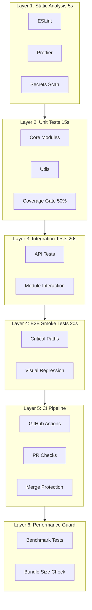

# 多层测试防护网系统设计

## 核心理念

作为顶尖程序员，我设计这个系统遵循以下原则：

- **金字塔结构**：底层快速、顶层全面
- **快速失败**：问题越早发现越好
- **单一命令**：`npm run verify` 一键完成所有验证
- **明确反馈**：清晰的通过/失败标准

## 系统架构



## 分层详细设计

### Layer 1: 静态分析层（~5s）

**目标**：在代码提交前拦截基础问题

| 检查项   | 工具      | 配置位置               |
| -------- | --------- | ---------------------- |
| 代码规范 | ESLint    | `.eslintrc.js`（已有） |
| 格式化   | Prettier  | `.prettierrc`（已有）  |
| 敏感信息 | gitleaks  | 新增 `.gitleaks.toml`  |
| 依赖漏洞 | npm audit | 内置                   |

**新增配置**：[.gitleaks.toml](.gitleaks.toml) - 扫描 API Key、密码等敏感信息

### Layer 2: 单元测试层（~15s）

**目标**：快速验证核心模块逻辑

现有 20 个单元测试文件，需要优化：

- 启用并行执行（`--pool=threads`）
- 设置覆盖率门禁提升至 **50%**（当前 40%）
- 只运行受影响的测试（`--changed`）

**关键配置更新**：

```javascript
// vitest.config.js 优化
export default defineConfig({
  test: {
    pool: 'threads', // 并行执行
    poolOptions: { threads: { singleThread: false } },
    coverage: {
      thresholds: {
        statements: 50,
        branches: 50,
        functions: 50,
        lines: 50
      }
    }
  }
});
```

### Layer 3: 集成测试层（~20s）

**目标**：验证模块间协作正确性

- [tests/api/](tests/api/) - 3 个 API 测试文件
- [tests/integration/full-flow.test.js](tests/integration/full-flow.test.js) - 完整流程测试

### Layer 4: E2E 烟雾测试层（~20s）

**目标**：验证关键用户路径

**优化策略**：

- 仅运行 `@smoke` 标签的关键测试（速度优先）
- 视觉回归测试使用 Playwright 内置截图对比

```javascript
// playwright.config.js 新增
projects: [
  {
    name: 'smoke',
    testMatch: /@smoke/,
    timeout: 30000
  }
];
```

**视觉回归实现**：

```javascript
// 使用 Playwright 内置功能
await expect(page).toHaveScreenshot('chat-window.png', {
  maxDiffPixelRatio: 0.01 // 允许 1% 差异
});
```

### Layer 5: CI/CD 流水线

**目标**：自动化验证 + 合并保护

新建 [.github/workflows/verify.yml](.github/workflows/verify.yml)：

```yaml
name: Verify
on: [push, pull_request]

jobs:
  verify:
    runs-on: ubuntu-latest
    steps:
      - uses: actions/checkout@v4
      - uses: actions/setup-node@v4
        with:
          node-version: '20'
          cache: 'npm'

      # Layer 1: Static Analysis
      - run: npm ci
      - run: npm run lint
      - run: npm run format:check
      - run: npx gitleaks detect --source . --verbose

      # Layer 2-3: Unit + Integration
      - run: npm run test:coverage

      # Layer 4: E2E Smoke
      - run: npx playwright install --with-deps chromium
      - run: npm run test:e2e:smoke

      # Layer 6: Bundle Size
      - run: npm run build:check
```

**Branch Protection 规则**（GitHub 设置）：

- 要求 `verify` 检查通过
- 禁止直接 push 到 main
- 要求 PR review

### Layer 6: 性能守卫层

**目标**：防止性能退化

**a) 基准测试**：新建 [tests/benchmark/](tests/benchmark/)

```javascript
// tests/benchmark/render.bench.js
import { bench } from 'vitest';

bench(
  'message render',
  () => {
    renderMessage({ role: 'assistant', content: '...' });
  },
  { iterations: 1000 }
);
```

**b) Bundle Size 检查**：使用 `size-limit`

```json
// package.json 新增
"size-limit": [
  { "path": "renderer/**/*.js", "limit": "500 KB" }
]
```

## 一键验证命令

**核心实现**：新增 [scripts/verify.js](scripts/verify.js)

```javascript
#!/usr/bin/env node
// AI Coding 专用验证脚本
const steps = [
  { name: 'Lint', cmd: 'npm run lint' },
  { name: 'Format', cmd: 'npm run format:check' },
  { name: 'Secrets', cmd: 'npx gitleaks detect --source .' },
  { name: 'Unit Tests', cmd: 'npm run test:coverage' },
  { name: 'E2E Smoke', cmd: 'npm run test:e2e:smoke' }
];
// 串行执行，任一失败立即退出
```

**package.json 新增脚本**：

```json
{
  "verify": "node scripts/verify.js",
  "verify:quick": "npm run lint && npm test",
  "test:e2e:smoke": "playwright test --grep @smoke"
}
```

## 验证结果输出

成功时：

```
✓ Layer 1: Static Analysis     [PASS] 3.2s
✓ Layer 2: Unit Tests          [PASS] 12.1s  (coverage: 52%)
✓ Layer 3: Integration Tests   [PASS] 8.4s
✓ Layer 4: E2E Smoke Tests     [PASS] 15.3s

━━━━━━━━━━━━━━━━━━━━━━━━━━━━━━━━━━━━━━━━
✓ ALL CHECKS PASSED - Safe to commit
  Total time: 39.0s
━━━━━━━━━━━━━━━━━━━━━━━━━━━━━━━━━━━━━━━━
```

失败时：

```
✓ Layer 1: Static Analysis     [PASS] 3.2s
✗ Layer 2: Unit Tests          [FAIL] 8.1s
  └─ FAILED: tests/unit/chatManager.test.js
     Expected: 'hello'
     Received: 'world'

━━━━━━━━━━━━━━━━━━━━━━━━━━━━━━━━━━━━━━━━
✗ VERIFICATION FAILED - DO NOT COMMIT
━━━━━━━━━━━━━━━━━━━━━━━━━━━━━━━━━━━━━━━━
```

## 文件变更清单

| 操作 | 文件路径                                         |
| ---- | ------------------------------------------------ |
| 新建 | `scripts/verify.js` - 一键验证脚本               |
| 新建 | `.github/workflows/verify.yml` - CI 流水线       |
| 新建 | `.gitleaks.toml` - 敏感信息扫描配置              |
| 新建 | `tests/benchmark/render.bench.js` - 性能基准测试 |
| 修改 | `package.json` - 新增验证脚本                    |
| 修改 | `vitest.config.js` - 并行优化 + 覆盖率提升       |
| 修改 | `playwright.config.js` - Smoke 测试配置          |
| 修改 | E2E 测试文件 - 添加 `@smoke` 标签                |

## AI Coding 使用指南

完成开发后，执行：

```bash
npm run verify      # 完整验证（<60s）
npm run verify:quick  # 快速验证（<30s，仅 lint + unit）
```

**合并标准**：

- `npm run verify` 全部通过 = 可安全合并
- 任一检查失败 = 必须修复后重试
