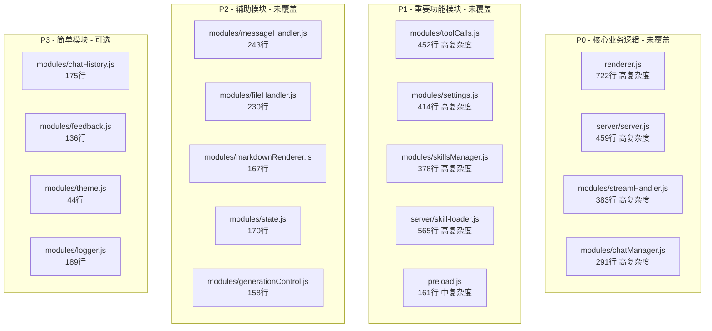
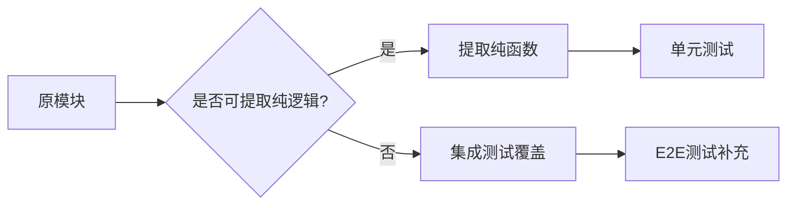

# 测试覆盖提升计划

## 一、现状分析

### 1.1 当前测试统计

| 测试类型 | 文件数 | 测试用例数 | 状态 |

|---------|--------|-----------|------|

| 单元测试 | 7 | 237 | 通过 |

| API 测试 | 1 | 11 | 通过 |

| E2E 测试 | 5 | 50+ | 通过 |

### 1.2 当前覆盖率（仅被测模块）

```
File               | % Stmts | % Branch | % Funcs | % Lines
-------------------|---------|----------|---------|--------
chatStore.js       |   90.19 |     79.1 |   86.66 |   91.3
sessionManager.js  |     100 |      100 |     100 |    100
uiHelpers.js       |   83.78 |    77.77 |   92.85 |  83.78
utils.js           |      70 |    68.51 |    87.5 |  69.76
-------------------|---------|----------|---------|--------
总体               |   82.22 |    79.48 |   92.42 |   81.9
```

### 1.3 覆盖盲区（未被测试的模块）



**问题识别**：

- 24个核心模块中仅4个有单元测试覆盖（16.7%）
- 8个高复杂度模块中0个有完整单元测试
- 总代码量约7000+行，仅约1200行被覆盖

---

## 二、改进目标

| 指标 | 当前值 | 目标值 | 达成周期 |

|------|--------|--------|---------|

| 模块覆盖率 | 16.7% (4/24) | 75% (18/24) | Phase 1-3 |

| 语句覆盖率 | 82% | 80%+ | 维持 |

| 分支覆盖率 | 79% | 75%+ | 维持 |

| 函数覆盖率 | 92% | 85%+ | 维持 |

| 高复杂度模块测试 | 0/8 | 6/8 | Phase 1-2 |

---

## 三、分阶段实施计划

### Phase 1: 补齐核心模块测试（优先级最高）

#### 1.1 server.js 深度测试增强

- **目标**: 完善 SSE 流处理、沙箱安全、会话管理的单元测试
- **文件**: [`tests/api/server.test.js`](server/server.js)
- **新增测试点**:
  - 工作区沙箱路径验证逻辑
  - SSE 事件类型完整性（`session_init`, `text`, `tool_use`, `tool_result`, `done`）
  - 会话恢复（resume）逻辑
  - 技能上下文注入
  - 错误处理边界

#### 1.2 新建 streamHandler.test.js

- **目标**: 测试 SSE 流解析的核心逻辑
- **文件**: 新建 `tests/unit/streamHandler.test.js`
- **模块**: [`renderer/modules/streamHandler.js`](renderer/modules/streamHandler.js)
- **测试点**:
  - `processSSEStream()` 主函数
  - 工具调用匹配逻辑
  - 文本内容累积
  - 错误事件处理
  - 流中断恢复

#### 1.3 新建 chatManager.test.js

- **目标**: 测试聊天管理的纯逻辑部分
- **文件**: 新建 `tests/unit/chatManager.test.js`
- **模块**: [`renderer/modules/chatManager.js`](renderer/modules/chatManager.js)
- **测试点**:
  - 聊天保存逻辑
  - 聊天加载逻辑
  - 聊天切换状态管理
  - 删除确认逻辑

### Phase 2: 高复杂度模块覆盖

#### 2.1 新建 toolCalls.test.js

- **目标**: 测试工具调用数据处理和状态管理
- **文件**: 新建 `tests/unit/toolCalls.test.js`
- **模块**: [`renderer/modules/toolCalls.js`](renderer/modules/toolCalls.js)
- **测试点**:
  - `createToolCallData()` 数据结构
  - 状态更新逻辑
  - 流式内容提取（`getStreamableContent`）
  - 时间线渲染数据准备

#### 2.2 新建 skillLoader.test.js

- **目标**: 测试技能加载的核心逻辑
- **文件**: 新建 `tests/unit/skillLoader.test.js`
- **模块**: [`server/skill-loader.js`](server/skill-loader.js)
- **测试点**:
  - 技能目录初始化
  - 技能内容加载
  - 安全过滤（`sanitizeSkillContent`）
  - 技能 Prompt 构建

#### 2.3 增强 settings.test.js

- **目标**: 覆盖 settings 模块的更多场景
- **文件**: [`tests/unit/settings.test.js`](tests/unit/settings.test.js)
- **新增测试点**:
  - 工作区配置验证
  - 诊断功能逻辑
  - 设置导入导出

### Phase 3: 辅助模块和集成测试

#### 3.1 新建 state.test.js

- **目标**: 测试集中状态管理
- **文件**: 新建 `tests/unit/state.test.js`
- **模块**: [`renderer/modules/state.js`](renderer/modules/state.js)
- **测试点**:
  - 单例模式
  - 状态更新
  - 订阅机制

#### 3.2 新建 messageHandler.test.js

- **目标**: 测试消息处理的纯逻辑
- **文件**: 新建 `tests/unit/messageHandler.test.js`
- **模块**: [`renderer/modules/messageHandler.js`](renderer/modules/messageHandler.js)
- **测试点**:
  - 消息数据提取
  - 对话历史构建
  - 消息恢复逻辑

#### 3.3 新建 fileHandler.test.js

- **目标**: 测试文件处理逻辑
- **文件**: 新建 `tests/unit/fileHandler.test.js`
- **模块**: [`renderer/modules/fileHandler.js`](renderer/modules/fileHandler.js)
- **测试点**:
  - 文件变更跟踪
  - 文件图标获取
  - 文件统计计算

### Phase 4: 基础设施优化

#### 4.1 添加覆盖率脚本

在 `package.json` 中添加：

```json
"test:coverage": "vitest run --coverage",
"test:coverage:html": "vitest run --coverage && open coverage/index.html"
```

#### 4.2 扩展覆盖率收集范围

修改 [`vitest.config.js`](vitest.config.js)：

```javascript
coverage: {
  include: [
    'renderer/**/*.js',
    'server/**/*.js',
    '!renderer/modules/theme.js',  // 简单模块可选排除
    '!renderer/modules/logger.js'
  ],
  exclude: ['node_modules/', 'tests/', '**/*.config.js', 'main.js']
}
```

#### 4.3 CI 集成

添加覆盖率门禁到 CI 流程，确保 PR 不降低覆盖率。

---

## 四、测试策略指南

### 4.1 模块可测试性重构

对于与 DOM 耦合的模块，采用以下策略：



**已成功案例**：

- `chatStore.js` - 纯函数库，100%可测
- `sessionManager.js` - 纯函数库，100%可测
- `utils.js` - 纯函数库，高可测性

**待重构**：

- `toolCalls.js` - 可提取 `createToolCallData`, `getStreamableContent` 等纯函数
- `streamHandler.js` - 可提取解析逻辑为纯函数
- `chatManager.js` - 可提取状态管理逻辑

### 4.2 Mock 策略

| 依赖类型 | Mock 方式 |

|---------|----------|

| localStorage | `vi.stubGlobal` |

| DOM 元素 | jsdom 环境或 Mock 对象 |

| fetch/API | `vi.mock` + MSW |

| Electron IPC | `vi.mock` |

### 4.3 测试命名规范

```
tests/
├── unit/           # 单元测试（纯逻辑）
│   ├── {module}.test.js
├── api/            # API 集成测试
│   ├── {endpoint}.test.js
├── e2e/            # 端到端测试
│   ├── {feature}.spec.js
└── integration/    # 新增：集成测试
    ├── {flow}.integration.test.js
```

---

## 五、优先级排序

| 优先级 | 模块 | 测试类型 | 预期工作量 |

|--------|------|---------|-----------|

| P0-1 | streamHandler.js | Unit | 中 |

| P0-2 | chatManager.js | Unit | 中 |

| P0-3 | server.js 增强 | API | 低 |

| P1-1 | toolCalls.js | Unit | 中 |

| P1-2 | skill-loader.js | Unit | 高 |

| P1-3 | settings.js 增强 | Unit | 低 |

| P2-1 | state.js | Unit | 低 |

| P2-2 | messageHandler.js | Unit | 中 |

| P2-3 | fileHandler.js | Unit | 中 |

| P3 | 覆盖率基础设施 | Config | 低 |

---

## 六、预期成果

完成全部 Phase 后：

- 核心模块测试覆盖率: 80%+
- 高复杂度模块: 6/8 有单元测试
- 总测试用例: 400+
- CI 覆盖率门禁: 已集成
