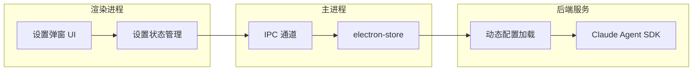

# 系统设置模块实施计划

## 背景

当前应用使用 Claude Agent SDK 直连 Anthropic API，硬编码在 `server/server.js` 中。企业部署需要支持配置内部 API 端点。

## 架构设计



## 核心改动文件

| 文件 | 改动内容 |

|------|----------|

| [package.json](package.json) | 添加 `electron-store` 依赖 |

| [main.js](main.js) | 集成 electron-store，暴露 IPC 通道 |

| [preload.js](preload.js) | 暴露 `getSettings`/`saveSettings` API |

| [server/server.js](server/server.js) | 支持从配置读取 API 端点/密钥 |

| [renderer/index.html](renderer/index.html) | 添加设置按钮入口 + 设置弹窗 |

| [renderer/renderer.js](renderer/renderer.js) | 添加设置模块逻辑 |

| [renderer/style.css](renderer/style.css) | 设置弹窗样式 |

## 配置项数据结构

```javascript
{
  apiEndpoint: "https://internal-api.company.com",  // 企业内部 API 端点
  apiKey: "sk-xxx",                                  // API 密钥
  models: [                                          // 可用模型列表
    { id: "minimax-2-1", name: "Minimax 2.1", default: true },
    { id: "glm-4-7", name: "GLM 4.7" }
  ]
}
```

## 设置 UI 入口位置

在左侧边栏底部添加设置齿轮图标，点击弹出设置弹窗（Modal）：

```
┌───────────────────┐
│ [+] New Chat      │
│ ─────────────────  │
│ 搜索聊天历史...     │
│ ─────────────────  │
│ 今天              │
│  • Chat 1         │
│  • Chat 2         │
│ ─────────────────  │
│ (底部留白)         │
│ [⚙] Settings     │  <-- 新增
└───────────────────┘
```

## 设置弹窗 UI

```
┌──────────────────────────────────────┐
│  系统设置                    [X]     │
├──────────────────────────────────────┤
│                                      │
│  API 端点                            │
│  ┌──────────────────────────────┐   │
│  │ https://api.anthropic.com    │   │
│  └──────────────────────────────┘   │
│                                      │
│  API 密钥                            │
│  ┌──────────────────────────────┐   │
│  │ sk-ant-xxx...      [👁]      │   │
│  └──────────────────────────────┘   │
│                                      │
│  可用模型                            │
│  ┌──────────────────────────────┐   │
│  │ + 添加模型                    │   │
│  │ • Minimax 2.1 [默认] [删除]   │   │
│  │ • GLM 4.7           [删除]   │   │
│  └──────────────────────────────┘   │
│                                      │
│       [取消]      [保存设置]          │
└──────────────────────────────────────┘
```

## 实施步骤

### 第一步：添加依赖和主进程改造

1. 安装 `electron-store` 依赖
2. 在 `main.js` 中初始化 electron-store
3. 添加 IPC 通道处理设置的读取/保存

### 第二步：Preload 桥接

1. 在 `preload.js` 中暴露 `electronAPI.getSettings()` 和 `electronAPI.saveSettings()`
2. 添加配置变更通知机制

### 第三步：后端服务配置化

1. 修改 `server/server.js`，启动时读取配置文件
2. 支持动态切换 API 端点（可选：通过环境变量或配置接口）
3. 添加 `/api/config` 端点供前端获取/更新配置

### 第四步：前端 UI 实现

1. 在 `index.html` 左侧边栏底部添加设置按钮
2. 添加设置弹窗 Modal HTML 结构
3. 在 `renderer.js` 中实现设置模块逻辑
4. 添加弹窗样式到 `style.css`

### 第五步：集成测试

1. 验证设置保存和加载正常
2. 验证切换 API 端点后请求正确发送
3. 验证模型列表动态更新

## 安全考虑

- API 密钥存储在本地 electron-store 中，不上传服务器
- 设置弹窗中密钥默认隐藏，提供显示/隐藏切换
- 配置文件位置：`%APPDATA%/open-claude-cowork/config.json`（Windows）
